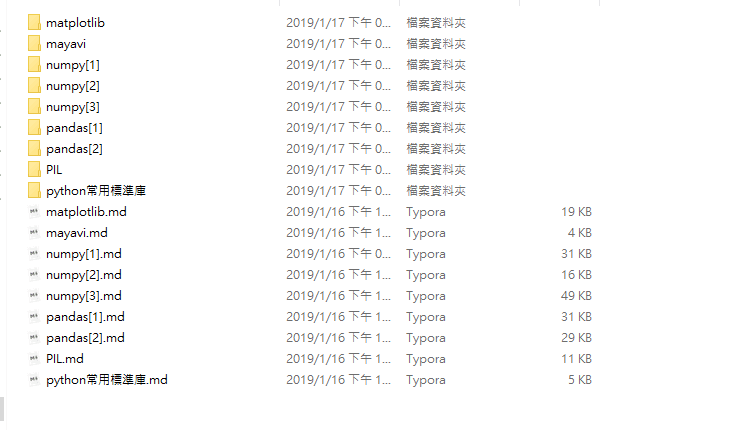
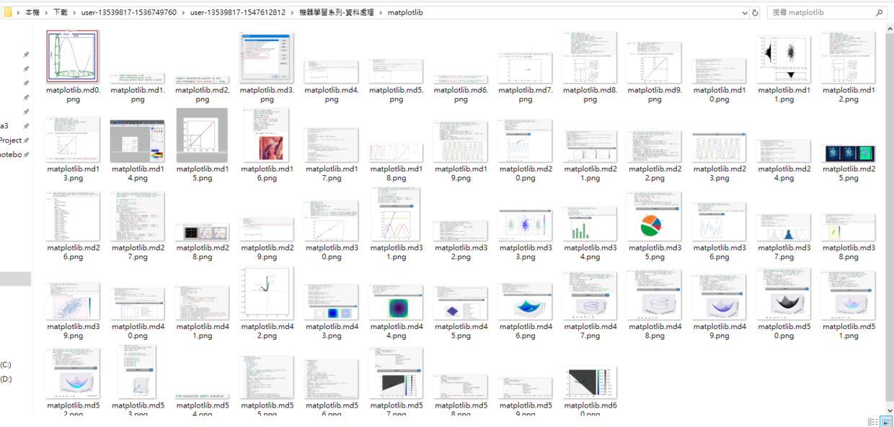

# Markdown圖片下載到本地

相信使用Markdown寫Blog的博主(例如:CSDN、簡書...)，沒有使用圖床時在備份資料以及圖片或移站時相當麻煩。

之前使用簡書礙於圖片當時都使用Ctrl+V貼上，本地沒有備份，簡書可以下載markdown的.md檔，但團片都是\!\格式連結到簡書本身圖床，所以寫了這個程式來自動下載markdown外連圖片。

指定存放.md的文件夾，會於文件夾中自動建立.md的同名文件夾，用來存放下載圖片。

> Usage: python3 markdown.py "dir-path"

       

